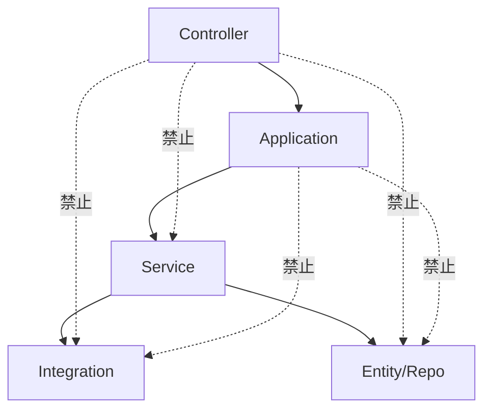
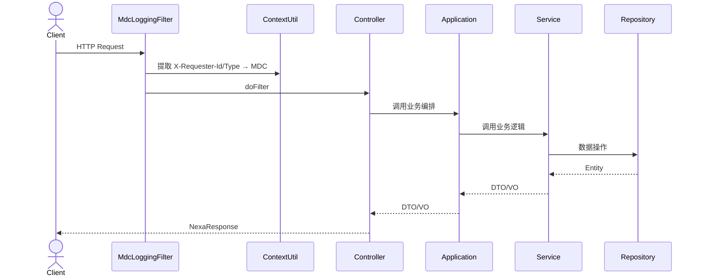

# 架构设计

## 四层架构

项目采用严格的四层架构，每一层有明确的职责边界和调用规则。

```
┌─────────────────────────────────────────────┐
│ Controller / Scheduler  │  REST API / 定时任务入口
├─────────────────────────────────────────────┤
│ Application             │  业务编排、事务管理
├─────────────────────────────────────────────┤
│ Service                 │  业务逻辑、领域服务
├─────────────────────────────────────────────┤
│ Integration + Entity    │  外部系统适配、数据持久化
└─────────────────────────────────────────────┘
```

### 层级职责

| 层级 | 职责 | 约束 |
|------|------|------|
| **Controller** | 接口定义、参数校验、返回 `NexaResponse<T>` | 只能调用 Application 层；`param/` 下所有校验注解必须声明 `message` |
| **Application** | 业务流程编排、事务控制（`@Transactional`） | 只能调用 Service 层；禁止包含具体业务逻辑；必须接口 + Impl 模式 |
| **Service** | 具体业务操作实现、单一职责 | 可操作 Integration 和 Entity；必须接口 + Impl 模式 |
| **Integration** | 外部系统调用的简单封装 | 禁止包含业务逻辑 |
| **Entity** | 数据实体、Repository | 继承 `BaseEntity` / `BaseRepo` |

### 调用规则



### 跨模块调用

- Service 层可被其他模块的 Application 层调用（业务复用）
- Controller、Application、Integration、Entity 禁止跨模块调用

## 请求处理流程



## 事务策略

- `@Transactional` 通常在 **Application 层**，负责主事务
- Service 层如需独立事务，使用 `@Transactional(propagation = REQUIRES_NEW)`
- 多个连续数据库操作必须在事务内执行

## 模块包结构模板

每个业务模块遵循以下包结构：

```
{module}/
├── controller/          # REST API
├── scheduler/           # 定时任务
├── application/         # 业务编排
│   └── impl/
├── service/             # 业务逻辑
│   └── impl/
├── dto/                 # 数据传输对象
├── vo/                  # 视图对象
├── param/               # Controller 参数
├── command/             # Service 参数
├── converter/           # MapStruct 转换器
├── enums/               # 枚举
├── integration/         # 外部系统集成
│   ├── {System}Client.java
│   ├── request/
│   └── response/
└── entity/              # 数据实体
    └── repo/
```
