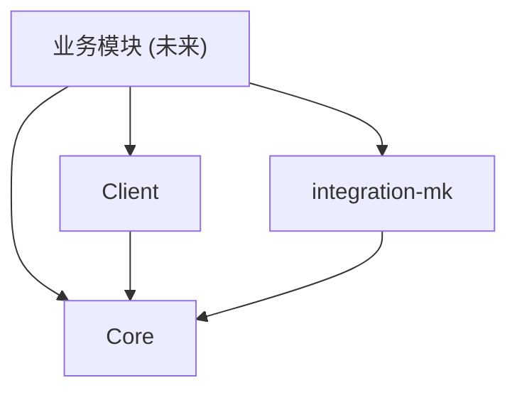

# 项目概览

## 项目定位

Nexa Apps 是 Nexa 平台的业务应用服务，基于 Spring Boot 4 微服务架构，负责承载各类业务应用的后端逻辑。通过 Nacos 实现服务注册与配置管理，通过 OpenFeign 与平台内其他微服务（如 Org 组织服务）协作。

## 目标

- 提供统一的业务应用开发框架，降低新模块的接入成本
- 通过标准化的四层架构确保代码可维护性和一致性
- 集成企业级基础设施（认证、可观测性、分布式锁）
- 支持与外部平台（MK/蓝凌等）的集成对接

## 模块清单

| 模块 | 包路径 | 职责 |
|------|--------|------|
| **core** | `shokz.nexa.apps.core` | 基础设施与通用能力：统一响应、异常体系、基础实体/仓储、安全配置、工具类 |
| **client** | `shokz.nexa.apps.client` | 内部微服务调用：Org 服务 Feign 客户端、DTO 定义、缓存解析器 |
| **integration-mk** | `shokz.nexa.apps.integration.mk` | MK 平台集成：OAuth 认证、API 调用封装 |

随着业务扩展，新的业务模块将以独立包的形式添加到 `shokz.nexa.apps` 下，每个模块遵循四层架构（Controller → Application → Service → Integration/Entity）。

## 模块依赖关系

所有业务模块依赖 `core`，按需依赖 `client` 和 `integration-mk`。模块间通过 `core` 提供的基础抽象保持一致性。
