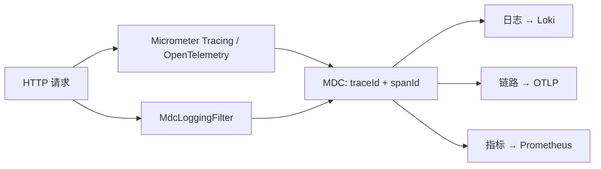

# 0002 — 可观测性方案

## 背景

微服务架构下需要跨服务追踪请求、统一收集指标、集中查询日志。要求：链路 / 指标 / 日志三者可关联（共享 traceId），技术栈与 Grafana 体系（Loki / Prometheus / Tempo）打通。

## 考虑过的方案

| 维度 | 候选 | 取舍 |
| ------ | ------ | ------ |
| 链路追踪 SDK | Spring Cloud Sleuth（已停维护）vs **Micrometer Tracing + OTel Bridge** | 选后者：官方推荐替代品，OpenTelemetry Protocol 标准 |
| 日志采集 | Fluent Bit / Filebeat 文件采集 vs **Loki Logback Appender 直推** | 选直推：减少一层文件 IO 与采集组件，部署更简单 |
| 指标 | 自研 endpoint vs **Spring Boot Actuator + Micrometer Prometheus Registry** | 选 Actuator：开箱即用，已包含 JVM / HTTP / 连接池指标 |
| MDC 写入 | AOP 拦截 vs **Servlet Filter** | 选 Filter：链路最早入口，确保所有日志都能拿到上下文 |

## 决定

### 三大支柱实现

| 维度 | 实现 |
| ------ | ------ |
| **链路追踪** | `spring-boot-starter-opentelemetry` 装配 OpenTelemetry SDK 与 OTLP 导出，`spring-boot-micrometer-tracing-opentelemetry` 接入 Boot 4 tracing 自动配置，Micrometer Tracing + `micrometer-tracing-bridge-otel` 桥接 |
| **指标监控** | Micrometer + Prometheus Registry，通过 Actuator 暴露 `/actuator/prometheus` |
| **日志聚合** | Loki Logback Appender 2.0.2 直推 Grafana Loki |
| **Feign 指标** | `feign-micrometer` 自动采集 Feign 调用耗时与状态 |

### 上下文传播

`MdcLoggingFilter` 从请求头提取 `X-Requester-Id` / `X-Requester-Type`，并将请求 URI / 方法写入 MDC。traceId/spanId 由 Micrometer Tracing 与 OpenTelemetry 自动配置产生并写入 MDC，使日志、响应与链路数据可关联。

## 理由

- **OpenTelemetry 标准**：避免锁定厂商，未来切换 APM 后端无需改业务代码
- **Loki 直推**：日志文件本身可省略（容器场景特别合适），减少磁盘与采集组件依赖
- **traceId 贯穿**：业务异常 / 日志 / 链路视图可一键跳转，排障路径最短

## 影响

- **正面**：故障定位时间显著缩短；指标 / 日志 / 链路三者可在 Grafana 单页关联
- **依赖**：必须有可达的 Loki / Prometheus / OTLP Collector
- **必须遵守**：自定义日志或 Filter 不得清空 MDC；新增网关层服务必须把 `X-Requester-*` 头透传到下游
