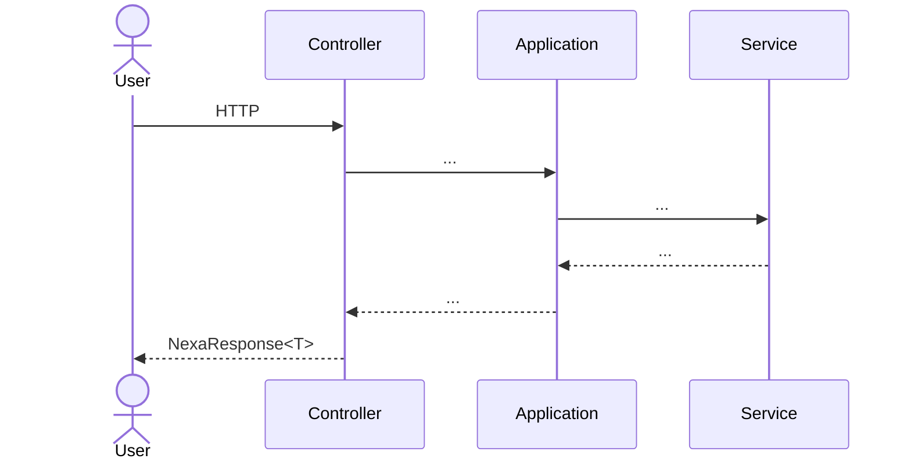
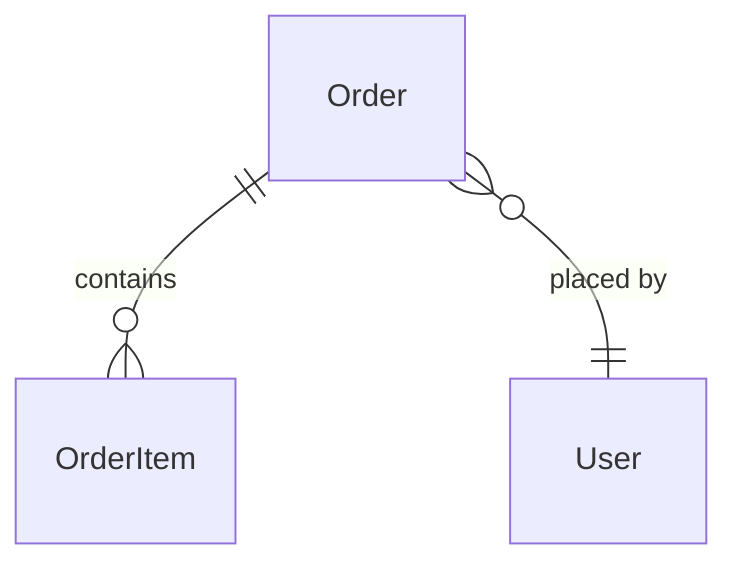

# {模块名} — 设计

<!--
模板使用说明：
1. 复制 docs/modules/_template/ 到 docs/modules/{your-module}/
2. 全局替换 "{模块名}" 与 "{module-package}"
3. 删除本注释和不适用章节
4. 填充实际内容
-->

## 概述

一两段话说明：模块解决什么业务问题、覆盖哪些功能边界、与其他模块的关系。

## 模块能力与业务规则

### 能力清单

| 能力 | 说明 |
|------|------|
| 能力 A | ... |
| 能力 B | ... |

### 业务规则

- **BR-1**：...（给规则编号便于代码注释/Story 引用）
- **BR-2**：...

### 依赖

- 内部：依赖的本仓库模块（如 `core` / `client`）
- 外部：依赖的外部系统（如某 Feign 服务、MQ、第三方 API）

## 包结构

```
{module-package}/
├── controller/
├── application/
├── service/
├── integration/         # 仅当对接外部系统
├── entity/
├── dto/  vo/  param/
├── enums/
├── converter/           # MapStruct
└── util/                # 仅当需要模块内工具
```

## 核心流程

### 流程 A



### 流程 B


## 数据模型

### 主要实体

| 实体 | 关键字段 | 说明 |
|------|---------|------|
| `XxxEntity` | id, ..., createdAt | ... |

实体关系图（如有多表关联）：



## 设计理由

### 为什么 X 而非 Y

- 背景：...
- 取舍：...
- 影响：...

> 涉及全局的技术决策应抽到 `docs/decisions/NNNN-*.md`，本节只放模块内部决策。

## 对外契约

参见 [`interfaces.md`](interfaces.md)。

## 代码级上下文

- `{module-package}/AGENTS.md` — 主包代码结构（如有）
