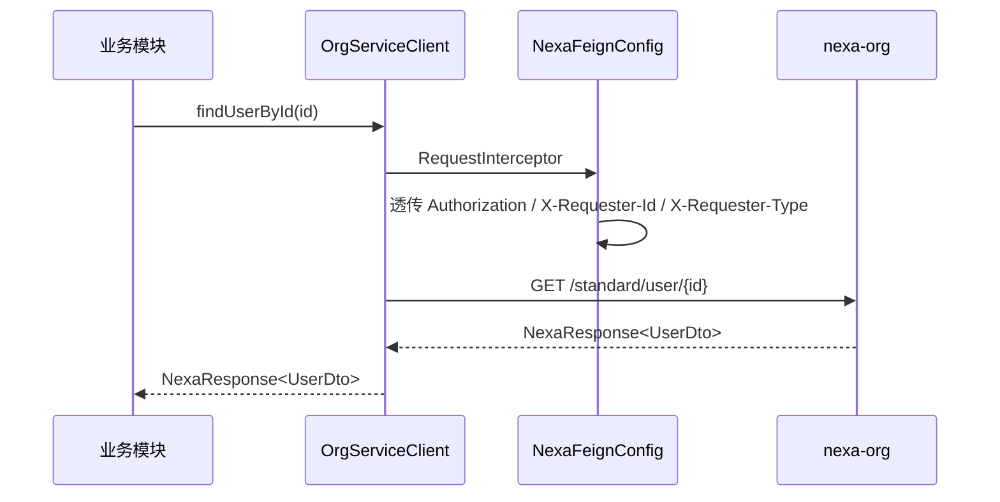
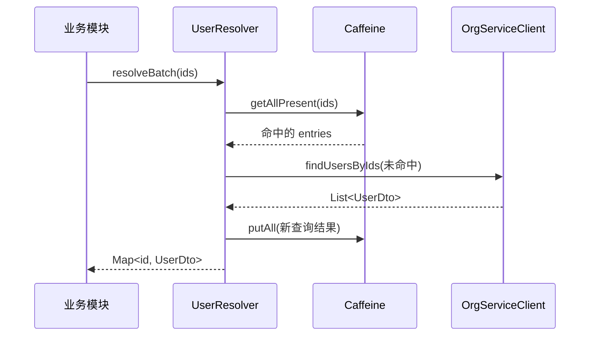

# client — 设计

## 概述

client 封装对 Nexa 平台内部微服务的 OpenFeign 调用，当前主要对接 Org（组织架构）服务。业务模块通过注入 Resolver 获取用户/部门数据，而非直接使用 Feign Client。

## 模块能力与业务规则

### 能力清单

| 能力 | 说明 |
|------|------|
| 组织服务调用 | 通过 OpenFeign 声明式调用 `nexa-org`：用户信息、部门信息、组织树、钉钉用户信息 |
| 请求头透传 | `NexaFeignConfig` 自动透传 `Authorization` / `X-Requester-Id` / `X-Requester-Type` |
| 用户解析与缓存 | `UserResolver` 单条/批量查询，Caffeine 进程内缓存 |
| MapStruct 集成 | `UserMappingHelper` 提供 `@Named` 解析方法，Mapper 中可自动 ID → UserDto |
| 部门解析与缓存 | `DepartmentResolver` 单条/批量查询，Caffeine 缓存 |
| 异常封装 | `ErrorResponseException` 将下游非成功响应转本地异常 |

### 业务规则

- **BR-1**：缓存为 Caffeine 进程内缓存，多实例间不共享；强一致场景需另行设计（如 Redis）
- **BR-2**：`resolveMandatory()` 在远端非成功时抛异常；`resolveOptional()` 返回 `Optional`
- **BR-3**：`UserMappingHelper.resolveUsersByIds()` 保证返回列表与输入 ID 列表**同序同长**，未命中位置为 `null`

### 依赖

- 内部：`core`（NexaResponse、ContextUtil）
- 外部：`nexa-org` 服务（Feign）

## 包结构

```
client/
├── common/
│   ├── config/
│   │   └── NexaFeignConfig.java         # 请求头透传
│   └── exception/
│       └── ErrorResponseException        # Feign 调用异常
└── org/
    ├── OrgServiceClient.java             # Feign 声明式客户端
    ├── UserDto / UserBasicDto            # 用户 DTO
    ├── DepartmentDto / DepartmentBasicDto / DepartmentTreeDto
    ├── DingtalkUserDto / DingtalkDepartmentBasicDto
    └── resolver/
        ├── UserResolver
        ├── DepartmentResolver
        ├── UserMappingHelper             # MapStruct 辅助
        └── DingtalkUserResolver
```

## 核心流程

### Feign 调用与头透传



### 带缓存的批量解析



## 数据模型

### 用户 DTO

| 类 | 说明 |
|----|------|
| `UserDto` | 用户主数据（姓名、工号、部门路径等） |
| `UserBasicDto` | 用户基础信息（ID、姓名、工号） |
| `DingtalkUserDto` | 钉钉用户信息（name / jobNumber / avatar / unionId） |

### 部门 DTO

| 类 | 说明 |
|----|------|
| `DepartmentDto` | 部门完整信息 |
| `DepartmentBasicDto` | 部门基础信息 |
| `DepartmentTreeDto` | 部门树结构 |
| `DingtalkDepartmentBasicDto` | 钉钉部门基础信息 |

## 设计理由

### Feign 头透传：集中配置而非逐 Client 配置

新增 Feign Client 时自动继承头透传，避免遗漏；网关已完成认证，服务间信任链基于内网，无需在每跳重新签发 Token。

### 异常封装 `ErrorResponseException`

将下游的非成功 `NexaResponse` 统一转换为本地异常，便于上层用 `try/catch` 而非反复检查响应码。

### 缓存选型：Caffeine 而非 Redis

用户/部门数据变更频率低，进程内缓存延迟远低于 Redis 网络开销；当前规模已足够，分布式缓存留作未来演进。**已知限制**：多实例部署时各实例缓存独立，存在短暂不一致窗口。

### 批量接口而非单条 N 次

`resolveBatch` 将多次单条调用合并为一次批量调用，避免 N+1 问题；输出与输入同序同长（未命中位置为 `null`），便于调用方按位置回填。

## 对外契约

参见 [`interfaces.md`](interfaces.md)。

## 代码级上下文

- [`client/AGENTS.md`](../../../src/main/java/shokz/nexa/apps/client/AGENTS.md)
