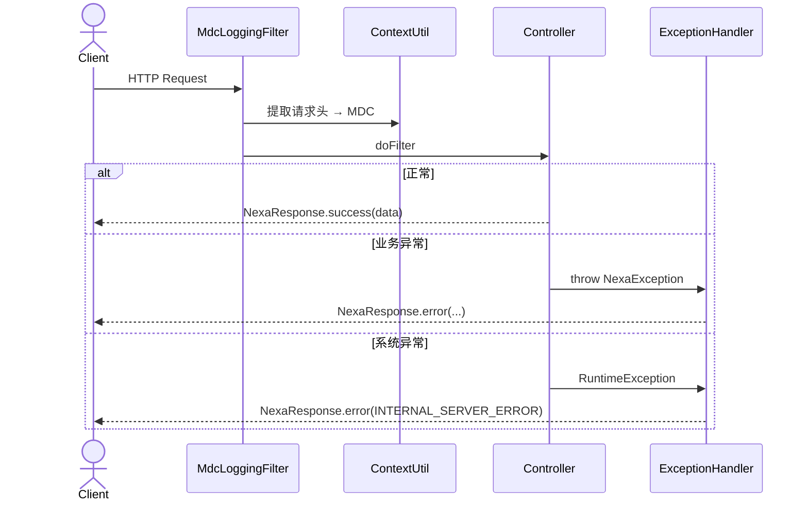
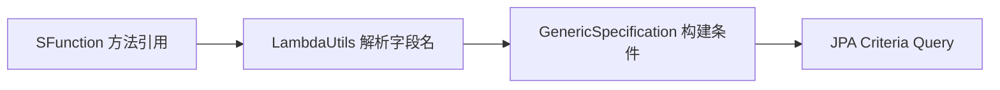

# core — 设计

## 概述

core 是全局基础设施层，为所有业务模块提供统一的实体基类、响应格式、异常处理、安全配置、上下文与通用工具。设计目标：**业务模块只关注业务逻辑，基础设施由 core 统一提供**。

core 本身不含业务逻辑，不暴露业务 Controller。

## 模块能力与业务规则

### 能力清单

| 能力 | 说明 |
|------|------|
| 统一响应 | `NexaResponse<T>`：code / message / data / traceId / service；提供 `success()` / `error()` / `optionalData()` / `mandatoryData()` |
| 基础实体 | `BaseEntity`：UUID v7 主键、审计字段（createdAt/updatedAt/createdBy/updatedBy）、`@SoftDelete` 软删除 |
| 基础仓储 | `BaseRepo`：`findByIdOrThrow()` / `findByIdOrNull()`，泛型实体名解析 |
| 异常体系 | `NexaException` + `ErrorType`，三层全局 `@ExceptionHandler` 统一转 `NexaResponse.error(...)` |
| 分页 | `PageParam`（page/size/sort + 稳定排序）、`PagedDataDTO`（hasMore/total/data）、`BaseMapper.toPagedDto()` |
| 请求上下文 | `MdcLoggingFilter` 提取 `X-Requester-Id` / `X-Requester-Type` 写入 MDC；`ContextUtil` 静态访问 |
| 动态查询 | `GenericSpecification` 基于 `SFunction` 方法引用构建 JPA 条件，支持等值/范围/模糊/IN/关联/排序 |
| 工具类 | `DistributedLockUtil`（Redisson 分布式锁/任务）、`RedissonUtil`、`JsonUtil`（复用 Spring ObjectMapper） |
| 业务配置 | `businessconfig` 子模块：`@BusinessConfig` 注解 + POJO + 数据库存值，运行时可调；详见 [子模块代码上下文](../../../src/main/java/shokz/nexa/apps/core/businessconfig/AGENTS.md) |

### 业务规则

- **BR-1**：所有实体表必须包含 `id`、审计字段、`deleted` 软删除标记
- **BR-2**：ID 生成策略统一使用 Hibernate `@UuidGenerator(style = VERSION_7)`
- **BR-3**：安全配置当前为 `permitAll`，真实权限在业务层通过 `@PreAuthorize` 控制
- **BR-4**：软删除行仍在数据库中，唯一性约束需用虚拟列结合 `deleted` 标记实现

### 依赖

- 内部：无（最底层）
- 外部：Spring Boot、Spring Security、Spring Data JPA、Hibernate、Redisson、Micrometer

## 包结构

```
core/
├── base/                       # 基础抽象
│   ├── BaseEntity / BaseRepo / BaseMapper
│   ├── BaseDto / BaseEnum / BaseEnumDto
│   ├── GenericSpecification
│   ├── PageParam
│   ├── converter/              # JPA 类型转换器
│   └── lambda/                 # SFunction / LambdaUtils
├── businessconfig/             # 动态业务配置子模块
├── config/                     # Spring 配置（Properties/Auditor/DateTime/Filter/Logging/Security）
├── dto/                        # NexaResponse / PagedDataDTO
├── exception/                  # NexaException / ErrorType
├── filter/                     # MdcLoggingFilter
├── handler/                    # 三层 ExceptionHandler
└── util/                       # ContextUtil / DistributedLockUtil / RedissonUtil / JsonUtil / Constant
```

## 核心流程

### 请求生命周期



### 动态查询构建



## 数据模型

### BaseEntity 通用字段

| 字段 | 类型 | 说明 |
|------|------|------|
| id | UUID v7 | Hibernate `@UuidGenerator(style=VERSION_7)` 原生生成 |
| createdAt | Instant | `@CreatedDate` 自动填充 |
| updatedAt | Instant | `@LastModifiedDate` 自动填充 |
| createdBy | String | `AuditorAwareImpl` 基于 `ContextUtil` 自动填充 |
| updatedBy | String | 同上 |
| deleted | boolean | Hibernate 7 `@SoftDelete`，查询时自动过滤 |

## 设计理由

### 为什么 BaseEntity 用继承而非组合

审计字段与软删除是**所有**实体的通用需求，继承更简洁；Hibernate 原生 `@SoftDelete` 在查询层自动过滤，减少遗漏风险，优于手动条件。

### 为什么主键用 UUID v7

分布式环境无需中心化 ID 生成器；UUID v7 的时间排序性保持索引友好，兼具唯一性与有序性。

### 为什么异常分三层处理器

业务异常（`NexaException`）、框架异常（参数校验/数据完整性/运行时）、安全异常（`AccessDeniedException`）有不同的日志级别与响应策略；分层后职责清晰，前端无需处理多种错误格式（最终都转 `NexaResponse.error`）。

## 对外契约

参见 [`interfaces.md`](interfaces.md)。

## 代码级上下文

- [`core/AGENTS.md`](../../../src/main/java/shokz/nexa/apps/core/AGENTS.md)
- [`core/businessconfig/AGENTS.md`](../../../src/main/java/shokz/nexa/apps/core/businessconfig/AGENTS.md)
