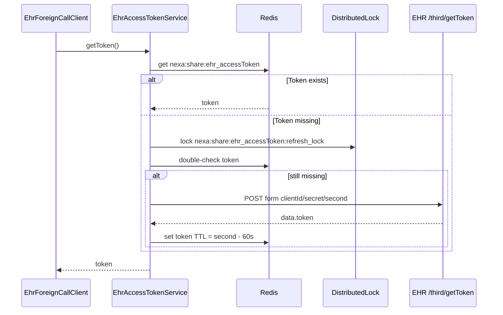

# integration-ehr — 设计

## 概述

`integration-ehr` 封装 EHR 第三方考勤只读接口，替代原 EXT-DEP-02 经 MK 中转的考勤查询路径。该包与 `integration-mk` 平级，只做协议适配：Token 获取、Redis 缓存、请求 envelope 组装、响应成功判定与异常封装。

工时业务层不直接依赖本包。`timesheet.integration.ehr.EhrMfgAttendanceClient` 将 EHR 响应映射为现有 MK DTO 形态，再委托 `AttendanceSnapshotAssembler` 聚合为 `AttendanceSnapshot`。

## 能力清单

| 能力 | 说明 |
|------|------|
| EHR Token 管理 | `EhrAccessTokenService` 调 `/third/getToken` 获取 Token，Redis 缓存并用分布式锁防止多实例重复刷新 |
| 五类只读查询 | `EhrForeignCallClient` 调日考勤、请假、补卡、出差、调班五个接口 |
| 固定 EHR 直连 | `EhrMfgAttendanceClient` 是当前唯一 Spring `MfgAttendanceClient` 实现 |
| 共用考勤聚合 | EHR 与历史 MK 适配共用 `AttendanceSnapshotAssembler`，避免制造/研发可用工时规则漂移 |
| S-08 回落写穿 | 缓存未命中时在既有 `sync_source VARCHAR(20)` 列写入 `FALLBACK_EHR`；不新增 Flyway、不修改生产表结构 |

## 包结构

```text
integration/ehr/
├── EhrForeignCallClient.java              # 五类 EHR 业务查询
├── auth/
│   └── EhrAccessTokenService.java         # Token 获取、Redis 缓存、分布式锁
├── config/
│   └── EhrProperties.java                 # ehr.* 配置，启动时校验必填
├── exception/
│   └── EhrApiResponseException.java
├── request/
│   └── EhrForeignCallRequest.java         # { paramStr, tokenStr } envelope
└── response/
    ├── EhrApiResponse.java                # code/success/data/message
    └── EhrTokenDataResponse.java          # /third/getToken data 节点

timesheet/integration/ehr/
└── EhrMfgAttendanceClient.java            # MfgAttendanceClient 的 EHR 实现
```

## 核心流程

### Token 获取与缓存



`clientId`、`secret`、`second` 以 `application/x-www-form-urlencoded` 传递，避免 secret 出现在 URL query、网关访问日志或 APM 采集链路中。日志禁止打印 token/secret。

### 工时侧接入

`EhrMfgAttendanceClient` 固定实现 `MfgAttendanceClient`。制造申请/补填/生成、研发申请/修改/锁定，以及 S-08 员工日考勤缓存均只注入该接口；MK 项目、资产、成本中心等非考勤能力仍保留在 `integration-mk`。

### 考勤聚合

`EhrMfgAttendanceClient.loadSnapshot(employeeId, date)` 先用 `UserResolver` 将 org 用户 id 解析为工号，再并行调用五类 EHR 查询。五路结果仍映射为 `MkDailyAttendanceDto`、`MkLeaveOrderDto`、`MkSignCardOrderDto`、`MkTripOrderDto`、`MkChangeOrderDto`，并委托 `AttendanceSnapshotAssembler.assemble(...)`。

聚合规则保持与 MK 路径一致（EHR 日考勤加班：`overtime_total_hour` 取自 `overtime_card_hour || 0`，见 `MkDailyAttendanceDto.applyEhrOvertimeFromCardHour()`）：

- 研发可用工时 = `worktime_total_hour + overtime_total_hour`
- 制造无单据时 = `worktime_total_hour + overtime_total_hour`
- 制造有补卡且无请假时 = `8 + overtime_total_hour`
- 制造有请假时 = `8 - holiday_salaried_hour + overtime_total_hour`
- 请假、补卡、出差等占位行以对应 `*_order_code` 非空为有效单据判定

## 与 MK 路径差异

| 项 | MK 路径 | EHR 路径 |
|----|--------|----------|
| 入口 | `/openapi/tic-definition/integrationInterface/call?functionCode=...` | `/thirdPlatformForeign/call/v2/{interfaceCode}` |
| 认证 | MK OAuth / Basic Auth 配置 | `/third/getToken` 获取 token，业务 body 携带 `tokenStr` |
| 请求参数 | MK functionCode 对应请求 DTO | EHR 统一 `{ paramStr, tokenStr }` envelope |
| Token 缓存 | `MkAccessTokenService` | `EhrAccessTokenService`，Redis 键 `nexa:share:ehr_accessToken` |
| 非考勤能力 | 项目、资产、成本中心等继续走 MK | 不承载非考勤能力 |

## 联调 Runbook

### 前置检查

1. 生产或预发已部署 EHR 直连版本。
2. Nacos 已配置 `ehr.domain`、`ehr.client-id`、`ehr.secret`、`ehr.token-second`、`ehr.connect-timeout-ms`、`ehr.read-timeout-ms`。
3. 准备一个可对比的员工工号、org 用户 id、考勤日期，以及 EHR 侧已知关键字段。

### 观察项

1. EHR 调用错误率。
2. `EhrAccessTokenService` token 刷新日志。
3. `ts_employee_daily_attendances.sync_source` 中 `FALLBACK_EHR` 分布（复用既有列，无 DB 迁移）。
4. 制造/研发详情页考勤刷新结果。
5. MK 项目、资产、成本中心等非考勤接口是否正常。

## 联调清单

正式域联调必须使用正式域 EHR 凭证。测试域当前仅鉴权接口可用，业务查询接口返回 HTTP 404，因此非正式域验证依赖 WireMock 单测。

| 步骤 | 验证点 |
|------|--------|
| Token | `/third/getToken` 返回 `code=200`、`success=true`、`data.token` 非空，Redis 写入带 TTL |
| 日考勤 | `getAttendanceDataMK` 返回正班、加班、带薪假、无薪假等字段 |
| 请假 | `getLeaveOrderMK` 返回有效 `leave_order_code` 行；兼容 `leave_orde_begin_time` 字段 |
| 补卡 | `getSignOrderMK` 返回有效 `sign_card_order_code` 行 |
| 出差 | `getTripOrderMK` 返回有效 `trip_order_code` 行 |
| 调班 | `getChangeOrderMK` 返回有效 `change_order_code` 行 |
| 聚合 | `loadSnapshot(employeeId, date)` 关键字段与 EHR 预期一致；差异登记为 EHR 口径 |
| S-08 | `loadDailyAttendance(employeeId, date)` 仅同步日考勤字段；缓存回落来源为 `FALLBACK_EHR`，复用既有 `sync_source` 列 |

## 测试与验证

本地和测试域验证优先运行 S-09 相关单测：

```bash
./mvnw test -q -Dtest=AttendanceSnapshotAssemblerTest,EhrMfgAttendanceClientTest,EhrAccessTokenServiceTest,EhrForeignCallClientTest,EmployeeDailyAttendanceServiceImplTest
```

成功标准：相关测试全部通过，`BUILD SUCCESS`。
