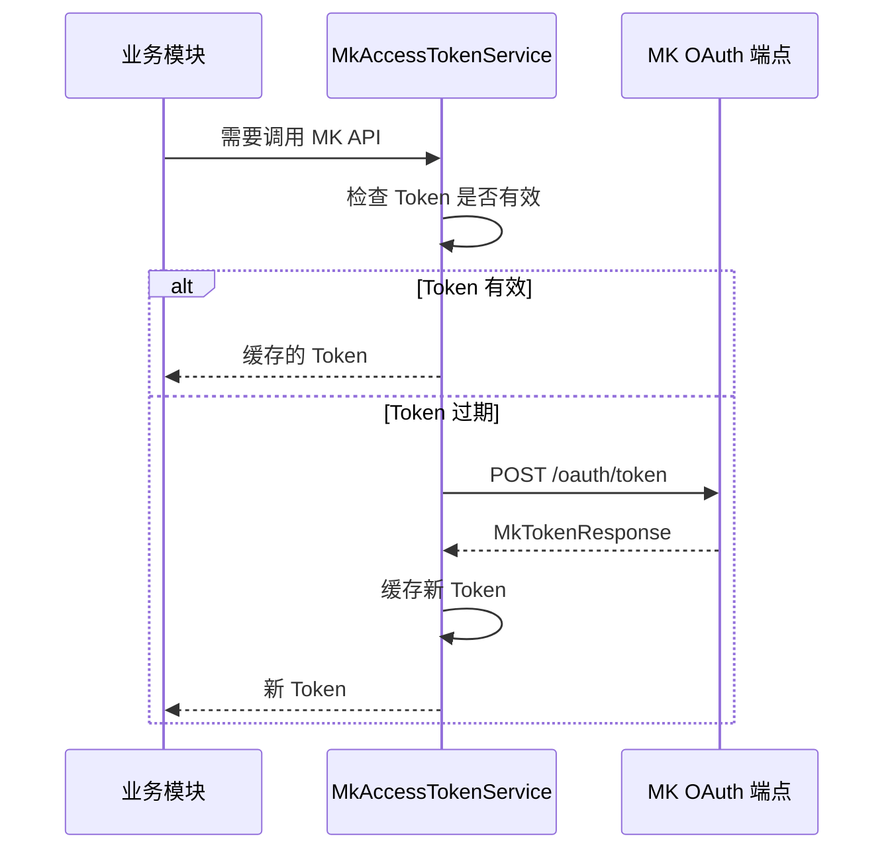
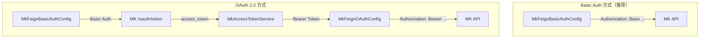

# integration-mk — 设计

## 概述

integration-mk 封装与 MK（蓝凌）平台的所有交互：两种 Feign 认证配置、Token 生命周期管理、统一响应模型与异常封装。作为 Integration 层，**仅做协议适配，不含业务逻辑**。

## 模块能力与业务规则

### 能力清单

| 能力 | 说明 |
|------|------|
| OAuth Token 管理 | 通过 MK OAuth 接口获取 Access Token；`MkAccessTokenService` 统一管理获取/刷新/缓存 |
| 双 Feign 配置 | `MkFeignBasicAuthConfig`（Basic Auth）/ `MkFeignOAuthConfig`（Bearer Token） |
| 统一响应模型 | `MkApiResponse`、`MkPagedDataDto`、`MkTokenResponse` |
| 异常封装 | `MkApiResponseException` 统一转换 MK API 非成功响应 |

### 业务规则

- **BR-1**：模块仅协议适配，**禁止包含业务逻辑**
- **BR-2**：请求/响应对象必须放在 `request/` 和 `response/` 子包中

### 依赖

- 内部：`core`（NexaResponse、异常体系）
- 外部：MK 平台 API

## 包结构

```
integration/mk/
├── auth/
│   └── MkAccessTokenService.java         # OAuth Token 获取与缓存
├── config/
│   ├── MkFeignBasicAuthConfig.java       # Basic Auth 配置
│   └── MkFeignOAuthConfig.java           # OAuth Bearer Token 配置
├── exception/
│   └── MkApiResponseException.java
├── request/
│   └── MkGetTokenRequest.java
└── response/
    ├── MkApiResponse.java
    ├── MkPagedDataDto.java
    └── MkTokenResponse.java
```

## 核心流程

### OAuth Token 获取与缓存



### 两种认证配置

| 配置 | 推荐场景 | 认证方式 |
|------|---------|----------|
| `MkFeignBasicAuthConfig`（**推荐**） | 大多数 MK API | HTTP Basic Auth |
| `MkFeignOAuthConfig` | 接口明确要求 OAuth Bearer 时 | 通过 `MkAccessTokenService` 获取 Bearer Token |



## 设计理由

### 为什么默认推荐 Basic Auth

1. **MK 接口文档对 OAuth 2.0 Token 携带方式缺乏统一明确说明**——不同接口的 Token 传递方式可能不一致，增加对接不确定性
2. **MK 当前 OAuth 实现将 access_token 放在 Query Param**——存在日志泄露风险：
   - 反向代理 / 网关访问日志通常记录完整 URL
   - 日志采集系统（ELK / Splunk）中 URL 可被广泛访问
   - 部分中间件 / 安全审计工具会持久化请求 URL
   
   虽然 HTTPS 加密整个请求，但 URL 在日志环节会以明文出现
3. **Basic Auth 凭证通过 `Authorization` Header 传递**，不出现在 URL 中，规避上述泄露问题

### 为什么提供双配置

将认证关注点与业务 API 定义解耦，开发者只需在 `@FeignClient(configuration = ...)` 选择配置类，无需处理认证细节。

### 为什么 Token 集中管理

`MkAccessTokenService` 集中管理避免了并发获取 Token 的竞争问题与重复 HTTP 调用。

## 对外契约

MK 开放 API 接口契约（functionCode、字段、示例）参见 [`interfaces.md`](interfaces.md)。
